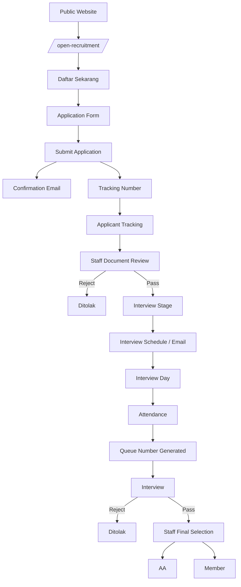
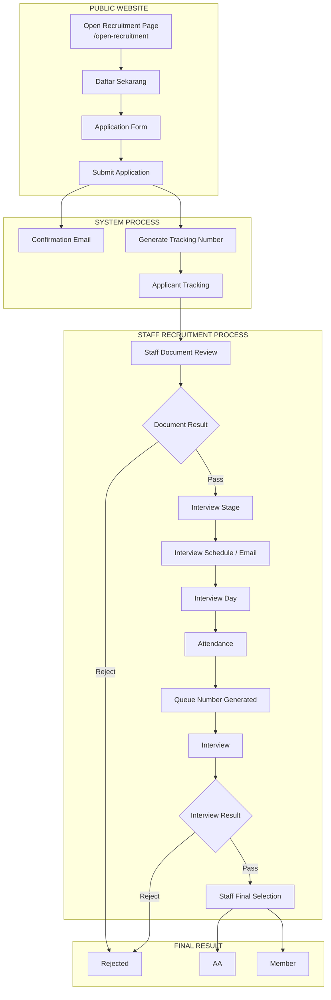
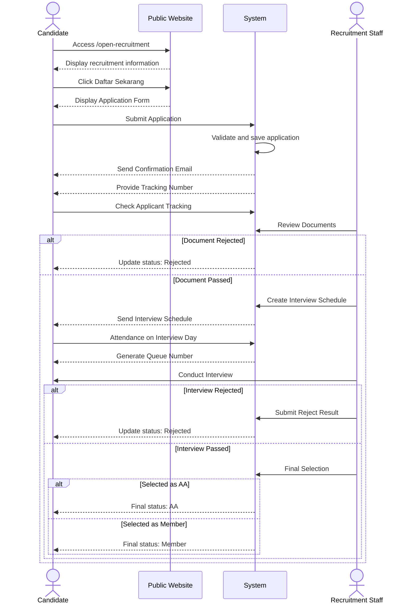

# Dokumentasi Flow Aplikasi Rekrutmen dan Form Pendaftaran

## 1. Gambaran Umum

Flow ini merupakan kombinasi **Business Flow** dan **Application Flow** untuk sebuah sistem **Open Recruitment / Recruitment Management System**.

Proses dimulai ketika kandidat mengakses website publik dan berakhir ketika kandidat **ditolak**, atau lolos seleksi akhir dan ditetapkan sebagai **AA** atau **Member**.

Secara umum:

```text
Open Recruitment
→ Pendaftaran
→ Submit Application
→ Tracking
→ Document Review
→ Interview
→ Final Selection
→ AA / Member
```

---

# 2. Jenis Flow

## Business Flow

Business Flow menjelaskan proses operasional rekrutmen:

```text
Pendaftaran
↓
Seleksi Administrasi
↓
Interview
↓
Seleksi Akhir
↓
Penetapan Kandidat
```

Business Flow menjawab pertanyaan:

> Bagaimana proses rekrutmen berjalan secara operasional?

## Application Flow

Application Flow menjelaskan bagaimana aplikasi mendukung proses bisnis tersebut:

```text
/open-recruitment
↓
Application Form
↓
Submit Application
↓
Tracking Number
↓
Applicant Tracking
↓
Staff Document Review
↓
Interview Schedule
↓
Attendance
↓
Queue Number
↓
Interview Result
↓
Final Selection
```

Dengan demikian, diagram ini bukan hanya flow form pendaftaran. Ini adalah **end-to-end recruitment workflow**.

---

# 3. Aktor yang Terlibat

## Kandidat / Applicant

Kandidat dapat:

- Mengakses halaman open recruitment.
- Mengisi formulir pendaftaran.
- Mengirim aplikasi.
- Menerima email konfirmasi.
- Mendapatkan tracking number.
- Melacak status pendaftaran.
- Mengikuti interview.
- Menerima hasil seleksi.

## Staff Rekrutmen

Staff bertugas untuk:

- Melakukan review dokumen.
- Menentukan kandidat Pass atau Reject.
- Mengatur jadwal interview.
- Melakukan attendance.
- Melakukan interview.
- Memberikan hasil interview.
- Melakukan final selection.

## Sistem

Sistem bertugas untuk:

- Menyimpan data kandidat.
- Memvalidasi formulir.
- Mengirim notifikasi atau email.
- Membuat tracking number.
- Menampilkan status aplikasi.
- Mengelola jadwal.
- Menghasilkan nomor antrean.
- Menyimpan hasil seleksi.

---

# 4. Flow Utama Secara Lengkap

## Tahap 1: Public Website

Proses dimulai dari **Public Website** melalui halaman:

```text
/open-recruitment
```

Halaman ini berfungsi sebagai landing page rekrutmen dan dapat berisi:

- Informasi Open Recruitment.
- Persyaratan pendaftaran.
- Timeline seleksi.
- Divisi atau posisi yang tersedia.
- Ketentuan pendaftaran.
- Tombol **Daftar Sekarang**.

---

## Tahap 2: Daftar Sekarang

Ketika kandidat menekan tombol **Daftar Sekarang**, sistem mengarahkan kandidat ke:

```text
Application Form
```

---

## Tahap 3: Application Form

Kandidat mengisi formulir pendaftaran.

### Data yang dapat dikumpulkan

**Data Pribadi:**

- Nama lengkap.
- Email.
- Nomor WhatsApp.
- Domisili.
- Institusi atau universitas.
- Program studi.

**Data Pendaftaran:**

- Pilihan divisi.
- Pilihan posisi.
- Motivasi.
- Pengalaman organisasi.
- Keahlian.

**Dokumen:**

- CV.
- Portofolio.
- Dokumen pendukung lainnya.

Setelah seluruh data lengkap, kandidat melanjutkan ke tahap submission.

---

## Tahap 4: Submit Application

Kandidat mengirimkan formulir.

Sistem melakukan:

1. Validasi field wajib.
2. Validasi format data.
3. Penyimpanan data kandidat.
4. Penyimpanan dokumen.
5. Pembuatan identitas aplikasi.

Status awal kandidat dapat menjadi:

```text
SUBMITTED
```

Setelah submission berhasil, flow menghasilkan dua proses utama:

1. **Confirmation Email**.
2. **Tracking Number**.

---

# 5. Confirmation Email

Sistem mengirimkan email konfirmasi kepada kandidat.

Isi email dapat mencakup:

- Konfirmasi pendaftaran berhasil.
- Nama kandidat.
- Informasi proses seleksi.
- Tracking Number.
- Instruksi untuk memantau status.

Tujuannya adalah memastikan kandidat mengetahui bahwa data berhasil diterima sistem.

---

# 6. Tracking Number

Sistem menghasilkan **Tracking Number** unik untuk setiap kandidat.

Contoh:

```text
REC-2026-00123
```

Tracking Number digunakan untuk:

- Mengidentifikasi kandidat.
- Melacak proses seleksi.
- Mengakses Applicant Tracking.

Tracking Number dapat ditampilkan setelah submit dan dikirim melalui email.

---

# 7. Applicant Tracking

Kandidat menggunakan Tracking Number untuk memantau status pendaftaran.

Contoh endpoint:

```text
/application-tracking
```

Informasi yang dapat ditampilkan:

- Tracking Number.
- Status aplikasi.
- Tahap seleksi.
- Jadwal interview.
- Hasil seleksi.

Contoh status:

```text
Submitted
Under Review
Document Passed
Interview Scheduled
Interview Completed
Accepted
Rejected
```

Dengan tracking, kandidat tidak perlu terus bertanya kepada panitia mengenai status. Sebuah kemenangan kecil bagi sistem informasi dan kesabaran manusia.

---

# 8. Staff Document Review

Setelah aplikasi diterima, staff melakukan:

```text
Staff Document Review
```

Staff memeriksa:

- Kelengkapan data.
- Validitas informasi.
- Kesesuaian persyaratan.
- CV.
- Portofolio.
- Pengalaman kandidat.
- Kesesuaian kandidat dengan posisi.

Tahap ini memiliki dua kemungkinan hasil.

## Reject

Jika kandidat tidak memenuhi persyaratan:

```text
Staff Document Review
        ↓
      Reject
        ↓
     Ditolak
```

Status:

```text
DOCUMENT_REJECTED
```

Data yang sebaiknya disimpan:

- Tanggal keputusan.
- Reviewer.
- Alasan internal.
- Catatan review.

## Pass

Jika kandidat lolos:

```text
Staff Document Review
        ↓
       Pass
        ↓
 Interview Stage
```

Status:

```text
DOCUMENT_PASSED
```

---

# 9. Interview Stage

Kandidat yang lolos administrasi masuk ke **Interview Stage**.

Tahap ini mencakup:

1. Pembuatan jadwal.
2. Pengiriman informasi interview.
3. Attendance.
4. Pembuatan nomor antrean.
5. Pelaksanaan interview.
6. Penilaian interview.

---

# 10. Interview Schedule / Email

Staff menentukan:

- Tanggal.
- Jam.
- Lokasi atau platform.
- Link meeting jika online.
- Interviewer.
- Instruksi interview.

Sistem mengirimkan:

```text
Interview Schedule / Email
```

Status kandidat:

```text
INTERVIEW_SCHEDULED
```

---

# 11. Interview Day dan Attendance

Pada hari interview:

```text
Interview Day
```

Kandidat kemudian dicatat melalui proses:

```text
Attendance
```

Kemungkinan status:

```text
PRESENT
LATE
ABSENT
CANCELLED
```

Jika kandidat hadir, proses berlanjut ke antrean interview.

Jika kandidat tidak hadir, sistem dapat menerapkan kebijakan:

- Gugur.
- Reschedule.
- No Show.

---

# 12. Queue Number Generated

Setelah attendance berhasil, sistem membuat:

```text
Queue Number Generated
```

Contoh:

```text
A-01
A-02
A-03
```

Tujuan:

- Mengatur urutan interview.
- Mempermudah pemanggilan kandidat.
- Memantau kandidat yang sudah dan belum diwawancara.

Status kandidat:

```text
WAITING_INTERVIEW
```

---

# 13. Interview

Kandidat menjalani proses:

```text
Interview
```

Staff atau interviewer dapat memberikan penilaian berdasarkan:

- Komunikasi.
- Motivasi.
- Kemampuan teknis.
- Kerja sama tim.
- Kesesuaian dengan divisi.
- Potensi kandidat.

Sistem menyimpan:

- Nilai.
- Catatan interviewer.
- Rekomendasi.
- Hasil interview.

---

# 14. Hasil Interview

## Reject

```text
Interview
    ↓
 Reject
    ↓
 Ditolak
```

Status:

```text
INTERVIEW_REJECTED
```

## Pass

```text
Interview
    ↓
  Pass
    ↓
Staff Final Selection
```

Status:

```text
INTERVIEW_PASSED
```

---

# 15. Staff Final Selection

Tahap:

```text
Staff Final Selection
```

Merupakan proses evaluasi akhir berdasarkan:

- Data pendaftaran.
- Hasil review dokumen.
- Hasil interview.
- Nilai kandidat.
- Kebutuhan organisasi.
- Jumlah kandidat yang dibutuhkan.

Tahap ini menentukan peran akhir kandidat.

---

# 16. Final Result

Setelah final selection, kandidat dapat ditetapkan sebagai:

## AA

```text
AA
```

AA merupakan kategori atau role sesuai struktur organisasi.

## Member

```text
Member
```

Kandidat resmi menjadi anggota.

Sistem dapat melanjutkan proses:

- Update role.
- Penempatan divisi.
- Aktivasi akun.
- Pengiriman acceptance email.

---

# 17. Lifecycle Status Kandidat

Rekomendasi status lengkap:

```text
DRAFT
↓
SUBMITTED
↓
UNDER_REVIEW
↓
DOCUMENT_REJECTED / DOCUMENT_PASSED
↓
INTERVIEW_SCHEDULED
↓
WAITING_INTERVIEW
↓
INTERVIEW_COMPLETED
↓
INTERVIEW_REJECTED / INTERVIEW_PASSED
↓
FINAL_SELECTION
↓
AA / MEMBER
```

---

# 18. Mermaid Flowchart



---

# 19. Mermaid Flow yang Lebih Terstruktur



---

# 20. Mermaid Sequence Diagram



---

# 21. Kesimpulan

Flow ini dapat disebut:

> **End-to-End Open Recruitment and Applicant Selection Workflow**

atau:

> **Recruitment Management System Flow**

Flow ini mencakup dua perspektif:

### Business Flow

```text
Registration
→ Document Selection
→ Interview
→ Final Selection
→ Acceptance
```

### Application Flow

```text
Public Website
→ Application Form
→ Submission
→ Tracking
→ Staff Review
→ Scheduling
→ Attendance
→ Queue
→ Interview
→ Final Result
```

Dengan demikian, aplikasi yang dibangun bukan sekadar **form pendaftaran**, tetapi sebuah **sistem manajemen rekrutmen dari awal hingga akhir**.

---

# 22. Rekomendasi Modul Aplikasi

## Public Module

- Open Recruitment Landing Page.
- Recruitment Information.
- Application Form.

## Applicant Module

- Application Submission.
- Confirmation Email.
- Tracking Number.
- Applicant Tracking.

## Staff Module

- Applicant List.
- Document Review.
- Status Management.
- Interview Scheduling.
- Attendance Management.
- Queue Management.
- Interview Evaluation.
- Final Selection.

## Notification Module

- Registration Confirmation.
- Application Status Update.
- Interview Invitation.
- Acceptance Notification.
- Rejection Notification.
